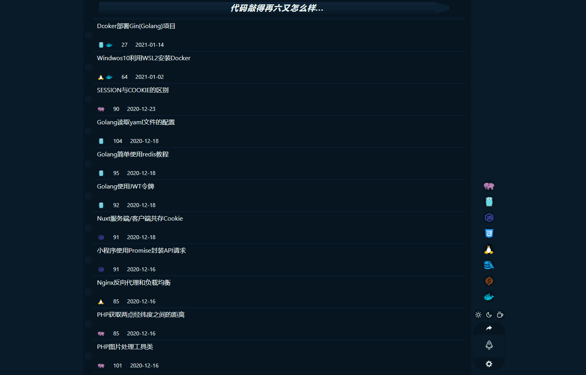
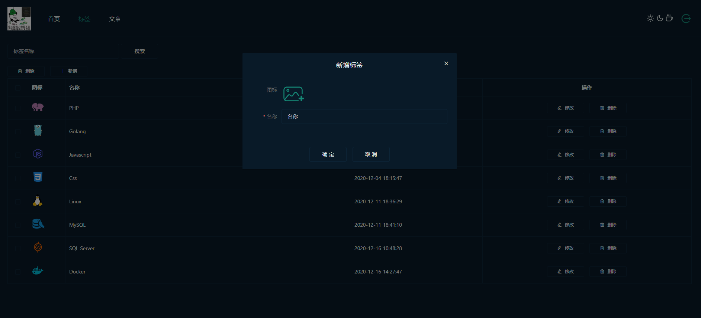
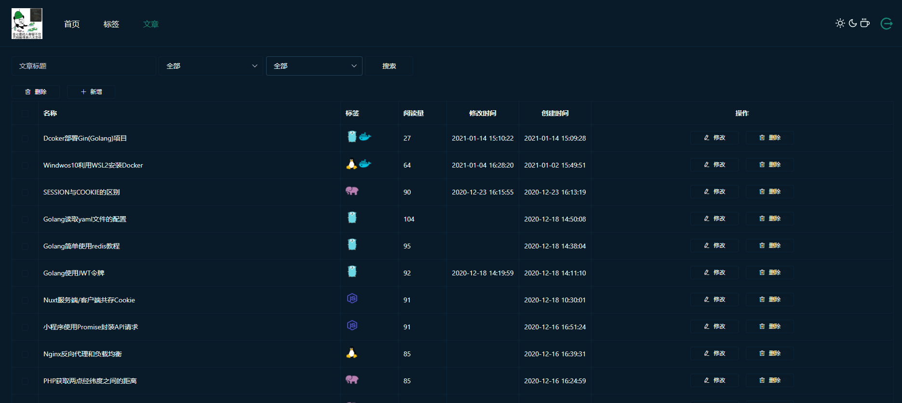
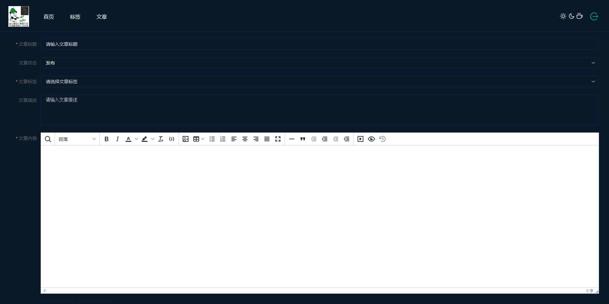

# NuxtBlog
Nuxt.js + Golang (Gin + Grom + Logrus) 打造的极简风格博客。

### 效果图





### 使用
#### 服务端
需要修改./server_api/configs/config.yaml配置文件的配置值，登录账号密码(username和pwd)、日志存储路径(logpath)、Redsi缓存配置cache和
MySQL数据库配置db。
server_api目录下还提供了Dcokerfile，也可以通过该Dockerfile构建项目；目前在线示例的服务端是通过该Dockerfile构建的。
#### 客户端
这个没啥好说，很基础了
```bash
npm run dev

npm run build
```
部署在服务器上可以通过pm2去跑。在线示例也是通过pm2跑的。
